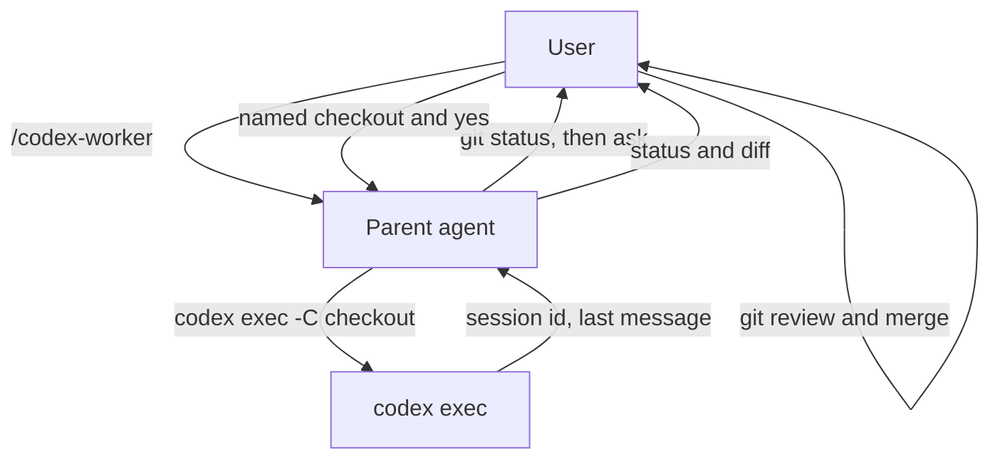

# `/codex-worker` architecture

Companion to [`codex-worker-skill-design.md`](codex-worker-skill-design.md). [`SKILL.md`](../skills/codex-worker/SKILL.md) wins for behavior. [`README.md`](../README.md) is the human index.

| Actor | Touches | Must not |
| --- | --- | --- |
| **User** | Chooses checkout. Reviews with git. | Be skipped at the gate. |
| **Parent** | Task file. Git inspection. One `codex exec`. | Spawn before a named path and a yes. Snapshot or apply. |
| **Codex** | Files under the accepted checkout. | Get `danger-full-access` from this skill. |

Isolation, when wanted, is a user-created branch or linked worktree. The skill does not invent a second tree.
