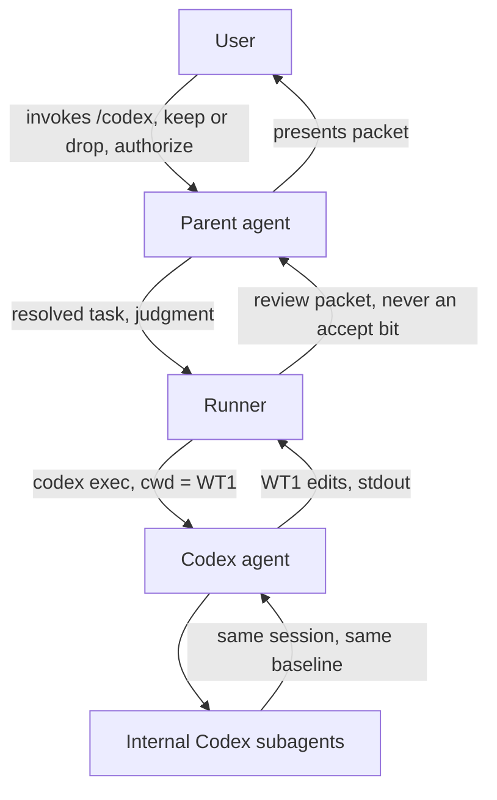
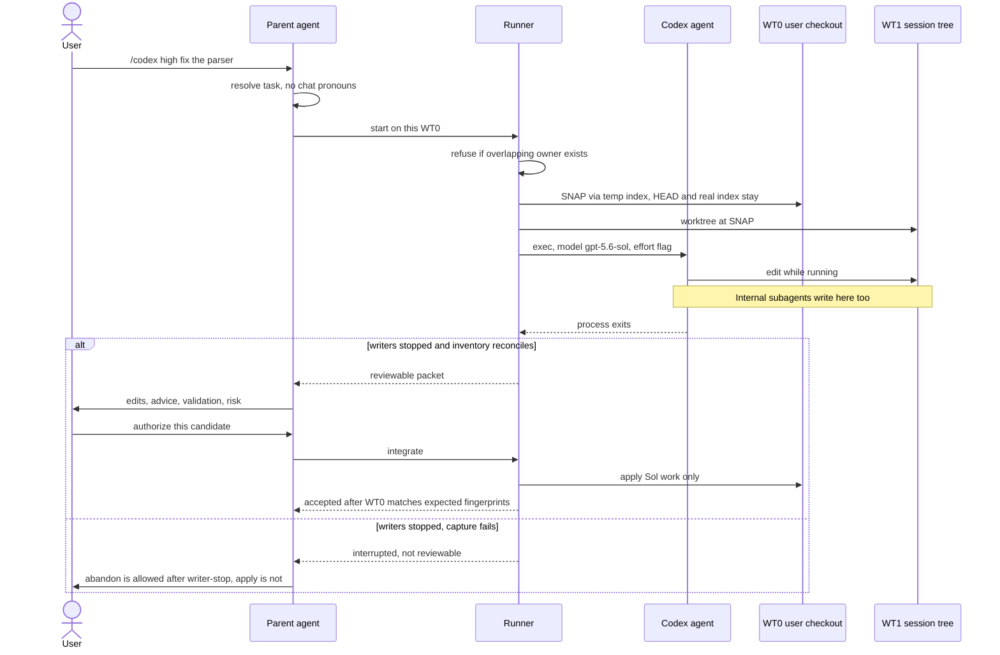
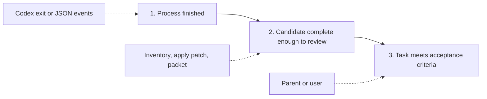
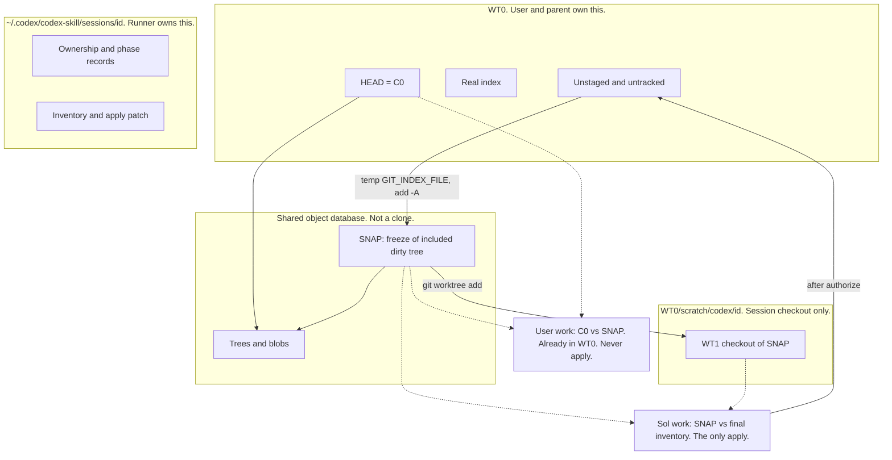
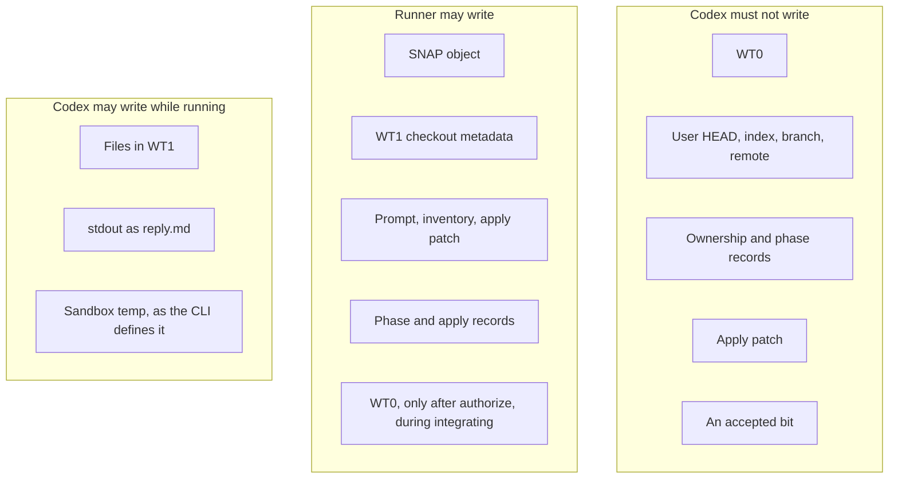
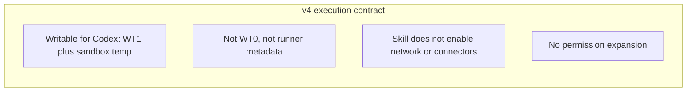
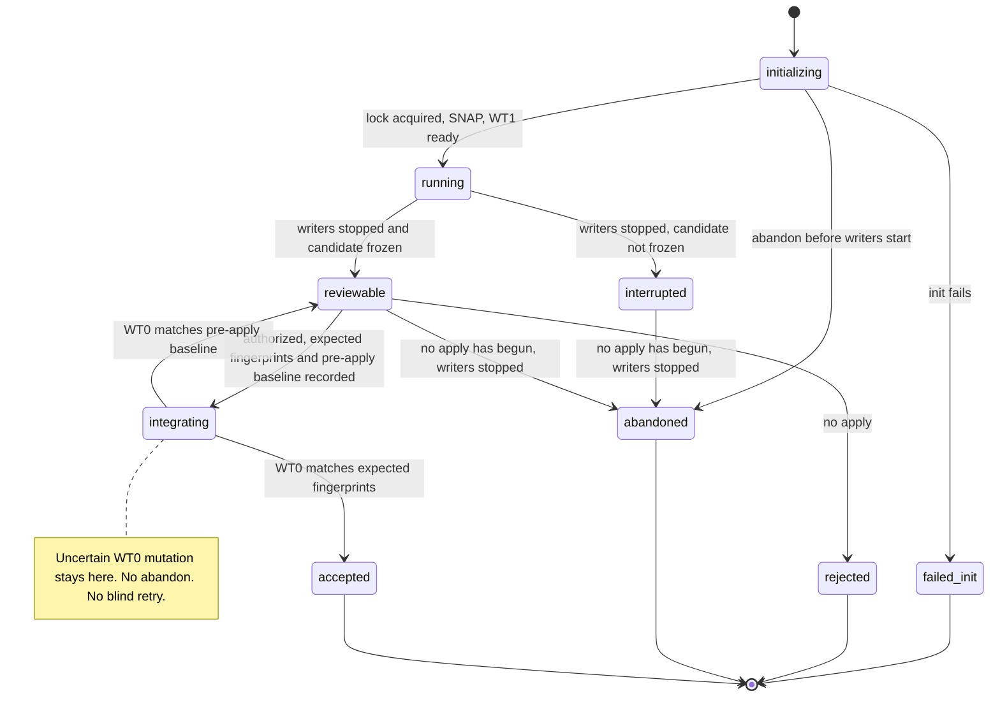
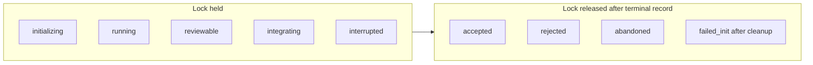
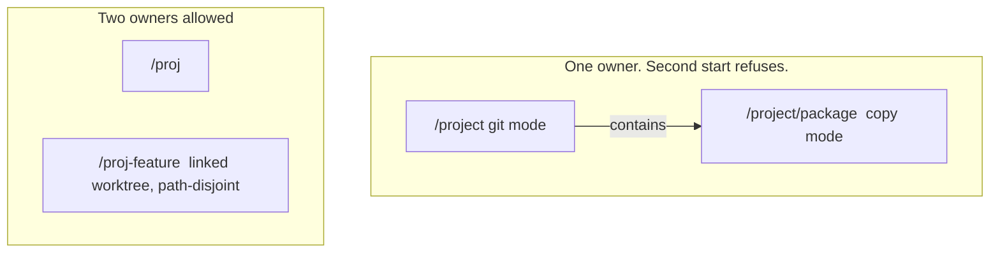
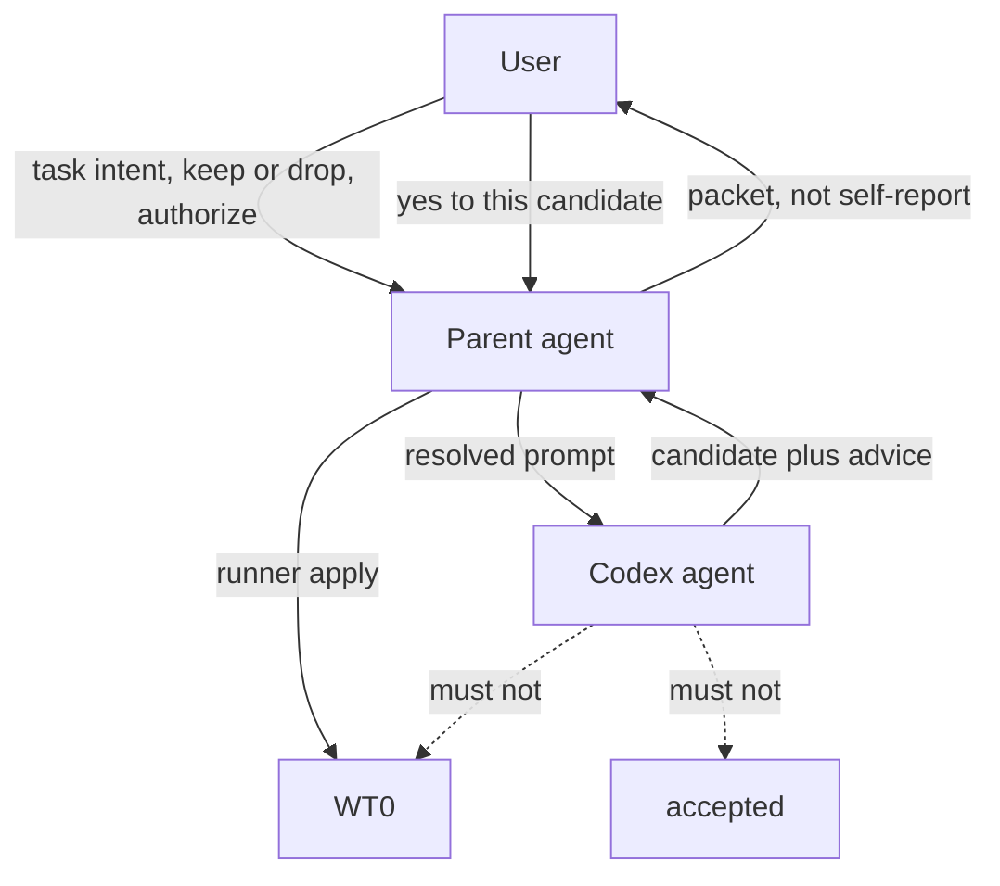

# `/codex` architecture

Companion to [`codex-skill-design.md`](codex-skill-design.md). That file is the source of truth for the protocol. This file is the picture: who acts, what they may touch, and how a run moves. [`README.md`](../README.md) is the human index (what `/codex` is, how to install it, runner verbs). If the two design files disagree, the design wins for protocol. If either disagrees with the runner, the runner wins for behavior and the docs should be corrected.

Shipped as **v4**. Skill source: `skills/codex/`. Install: `~/.cursor/skills/codex`. Runner: `scripts/run.sh` → `scripts/run.py`. Parent instructions: `SKILL.md`.

---

## 1. What the system is

The user types `/codex` in Cursor. The **parent agent** turns that into a self-contained task and calls a **runner**. The runner freezes the user's dirty checkout, gives **Codex** a private tree, and waits. Codex (GPT-5.6 Sol via local `codex exec`) may edit only that private tree. When it stops, the parent and user review **Sol's delta**, not Codex's opinion. Only they may authorize apply. The runner, not Codex, writes the user's tree, and only after that authorization.

Codex is a guest SWE. It is not a pstack role. It does not bill Cursor Task. Internal Codex subagents are workers of one session, not a second owner.

Three people in the protocol, one of whom is software:

| Actor | Job | Must not |
| --- | --- | --- |
| **User** | Start the run. Keep or drop. Authorize or refuse. | Trust Codex's "looks good." |
| **Parent agent** | Make the task executable without the chat. Call the runner. Judge the packet. On explicit request, choose how much to take. | Treat Markdown as the lock. Apply by ad-hoc shell. Set `accepted`. |
| **Codex agent** | Inspect and edit WT1. Run tests there. Recommend. | Touch WT0. Move git refs. Accept. Own a second session. |

The **runner** is not a fourth mind. It is the mechanical checker: overlap lock, snapshot, exec flags, inventory, apply, phase records. Parent prose that "should" release a lock is not a release.

---

## 2. Workflow

Happy path, git checkout. One-shot `codex exec`. No TUI, no `resume`, no queue.

Three judgments stay separate. Codex can prove at most the first.

A normal exit is not a reviewable candidate. A well-formed report is not "the task is done."

---

## 3. Isolation: two baselines

Goal: name **only Sol's delta** even when WT0 is dirty. No stash. No commit on the user branch. No `git init` in the user's unversioned project. Never push.

**WT0** is the user's checkout, the apply target. **WT1** is the session tree under `scratch/codex/<id>/wt`. **C0** is `HEAD` at init. **SNAP** is the freeze of WT0's included dirty tree. Parent of `SNAP` is `C0` when git exists.

Session metadata (phase, apply patch, fingerprints) lives under `~/.codex/codex-skill/sessions/<id>/`, not inside WT1. Codex must not be able to rewrite the apply artifact or the lock.

**Trap.** In WT1, `git diff` against `SNAP` is empty until Codex edits, and it still omits new untracked files. User changes are already inside `SNAP`. The prompt tells Codex to review user work vs `C0`. The runner, not Codex, builds the final inventory. If Codex adds `helper.py` and an import, capture that misses `helper.py` is a failed capture. Do not offer apply.

No-git path: copy the workspace under the input policy, `git init` **only inside the copy**, freeze `SNAP` as "now." There is no `C0` and no `user.patch`. Same rule: apply only Sol work, and only after authorize. Nested extra `.git` on the source is refused before the copy.

---

## 4. Boundaries: who may write what

`workspace-write` is not "everything stays in WT1." The CLI sandbox also treats temp directories such as `/tmp` as workspace, and it protects `.git` (including a linked worktree's resolved gitdir). Approvals are a second layer. v4 does not widen the sandbox because the task "needs" network or connectors. Denied operations return to the parent. They do not escalate to `danger-full-access`.

Start refuses layouts where WT0 or runner metadata sit under `/tmp`/`TMPDIR`, or where metadata would sit inside WT1. Clearing extra `writable_roots` is necessary and not enough by itself.

User config that already enables network is disclosed, not granted by the skill. Work that needs more authority than this contract refuses before exec.

---

## 5. Lifecycle

States are defined by **what is allowed**, plus **evidence** for the transition. A folder existing, or a pid looking alive, is not the phase.

`accepted` is not "the user said yes." It is authorization **and** a recorded apply whose result matches the fingerprints computed before mutation. Reverse `git apply --check` is not that proof.

Writer-stop and frozen candidate are different facts. Capture can fail after exec exits (filters, inventory mismatch). That session is `interrupted`, not `reviewable`. Abandon before apply does not require a successful inventory. Abandon from `running` while writers may still be alive is a protocol bug. Abandon from `integrating` is forbidden until the WT0 outcome is known.

v4 writer-stop for a process this runner spawned is SIGTERM, wait, SIGKILL of that process group, then wait. `pgrep` enumeration errors are not "stopped." Installed Codex leaving a `setsid` child outside the group is unproven. After freeze, `packet` and `authorize` re-hash the WT1 included tree. A changed hash forbids apply.

`git apply` without `--reject` is not rollback. Hunk checks that fail before writes leave WT0 unchanged. A write or close error after mutation has begun can leave WT0 partial. Stay in `integrating` unless a pre-apply baseline shows no change.

R1 lock lasts from atomic acquire in `initializing` until a **proven** terminal state. It does **not** die when `codex exec` exits. `reviewable` and `integrating` still own the apply target.

Proven-terminal leftover WT1 does not hold the lock. Unexplained leftover `scratch/codex/*/wt` under WT0 or any ancestor directory still does, including copy-mode parents. Stuck is better than a second session.

---

## 6. Ownership of the apply target (R1)

Exactly one top-level Codex session owns a given apply target at a time. The target is **WT0**, not WT1, not the object database, not `HEAD`.

Equal root strings are not enough. Git mode on `/project` and copy mode on `/project/package` are different keys and both can change `/project/package/file`.

Containment is on `realpath` path components, not raw prefix (`/project` does not contain `/project-extra`). Acquire is one atomic operation under a process-wide flock. Check-then-record as two steps is a race.

Do not walk above the workspace to find a parent git root for SNAP. A `git init` on `$HOME` must not become the snapshot. Nested sessions inside WT1 are refused. Leftover overlap checks do walk ancestors. That is a different rule.

Internal Codex subagents do not mint a second identity. Two parent `/codex` runs on overlapping targets do.

---

## 7. Authority (R2) and the three-way relationship

Codex may recommend. It may not close the loop. If the user asks the parent to integrate automatically, the **parent** chooses how much to take. That is still not Codex accepting.

Review must split:

1. Changes Codex actually made
2. Recommendations not implemented
3. Validation results
4. Unresolved problems or risks

Selective keep/drop is a parent-reviewed **group** of related edits. The runner's subset check is whole-path: every selected path must reach its complete frozen tree entry (mode, type, object). It cannot keep one of two edits inside the same file.

---

## 8. Read it as one circuit

User asks. Parent writes a task Codex can run without the chat. Runner locks the apply target, freezes dirty state into `SNAP`, and checks out WT1. Codex works only there. When the process is gone, the runner either freezes a complete inventory or reports that the candidate is not reviewable. Parent and user decide. Runner applies Sol work onto the still-dirty WT0, still uncommitted, still unpushed. Codex never held the user's `HEAD`, index, or an `accepted` bit.

Declared support limits and remaining Evidence items live in the design doc §12–§13 and in `SKILL.md`. They bound what this picture may claim. They are not extra actors. Symlink writes through an in-tree link that escapes the apply target remain Open.
