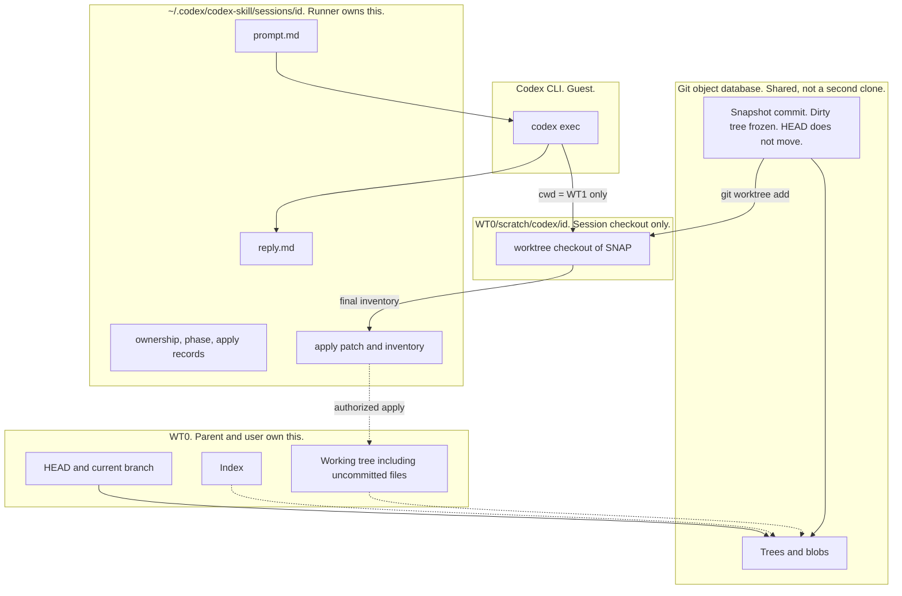

# `/codex` skill design

Status: **implemented (v4)**. This file is the source of truth for the protocol. The runner (`skills/codex/scripts/run.py`) and `SKILL.md` are the source of truth for shipped behavior. If this file disagrees with the runner, the runner wins and this file should be corrected. [`README.md`](../README.md) is the human index.

v4 lives in `skills/codex/` and installs to `~/.cursor/skills/codex`. WT1 is `<WT0>/scratch/codex/<id>/wt`. Session metadata is `~/.codex/codex-skill/sessions/<id>/` (override with `CODEX_SKILL_HOME`). Codex must not be able to rewrite the apply patch or the lock.

Five classes are used throughout. They are not interchangeable.

| Class | Meaning |
| --- | --- |
| **Decided** | Locked. Do not reopen unless explicitly asked. |
| **Proposed** | Written as a complete choice so it can be accepted or rejected. Not law until confirmed. |
| **Open** | A policy hole. Do not close it by inventing a mechanism in passing. |
| **Evidence** | A factual claim that must be established by docs, inspection, or test. Choosing a policy does not settle it. |
| **Support limit** | What v4 will not do, plus the refusal or excluded effect. Recorded in `SKILL.md` and in §12. Cannot waive a Decided requirement. May rewrite a requirement around remaining Evidence (§13). |

Prefer exposing an unsafe assumption over adding a flag, a state, or a fallback.

---

## 1. Purpose

Sol (GPT-5.6) is available on GPT Plus through the local Codex CLI. It is deliberately not a pstack role and not an entry on an automatic model map. Putting it there would bill Cursor for Sol on every playbook that used that role.

The user still wants Sol in the workflow without driving the Codex TUI by hand.

`/codex` is the opt-in path: a Cursor skill that shells out to the existing local RPC, then stops for parent/user review. It is a guest SWE path. It is not a pstack role and not an architect runner.

Plus billing is part of the reason this skill exists. Invoking a local `codex` binary does not by itself prove subscription authentication. API-key usage is billed through the API account.

---

## 2. Goals and non-goals

### Goals

- Invoke Sol with an effort flag from Cursor chat, billed as ChatGPT subscription use, not silent API-key spend.
- Isolate Sol's edits from the user's live checkout so review can name **only** Sol's delta, even when the user tree is dirty.
- Keep integration authority with the parent agent or the user. Codex does not accept its own work.
- Leave the user's git refs, real index, and pre-session dirty bytes alone until someone with authority applies a patch. Never commit or push as a side effect of the skill.

### Non-goals (v4)

- A pstack role, automatic or otherwise.
- Cursor `Task` with `gpt-5.6-sol-*` slugs. That bills Cursor and defeats Plus.
- Claimed support for Claude Code, OpenCode, or Pi. The task contract and WT0 input should not be Cursor-private. Support is claimed only for hosts that are validated. v4 claims Cursor.
- A shared `workspace/` dump that every agent writes. That is shared mutable state.
- Codex TUI, `codex resume`, a queue, or a second `/codex review` verb.
- `codex apply`, `codex mcp-server`, or `danger-full-access`.
- The skill turning on network access, connectors, or a wider sandbox because the task "needs" it.
- Silently running `git init` in an unversioned user project.
- Scraping OS Keychain. File auth only.
- Intra-file hunk selection. Subset authorize is whole-path against the frozen candidate.
- A billed proof that installed `codex exec` leaves no `setsid` descendants. See §9.

### Related context (not this design)

pstack roles, architect runners, and arena judges are a different path. They do not decide isolation or lifecycle for `/codex`.

---

## 3. Decision status

| Item | Class | Record |
| --- | --- | --- |
| Opt-in Cursor skill, not a pstack role | Decided | §1, §5 |
| v4 claimed host is Cursor; other hosts unclaimed | Decided | §5.1 |
| `/codex [low\|medium\|high\|xhigh\|max] <task>`, default `high` | Decided | §5 |
| Optional effort is an exact first-token match only | Decided | §5.2 |
| Local `codex exec`, `-m gpt-5.6-sol`, `-c model_reasoning_effort=...` | Decided | §5 |
| Not Cursor Task with Sol | Decided | §2 |
| Require ChatGPT file auth; refuse API keys; bind `cli_auth_credentials_store=file` | Decided | §5.3 |
| Live billed credential selection | Evidence | §5.3 |
| R1: one top-level Codex session per working-tree identity | Decided | §6 |
| Internal Codex subagents are workers of that session | Decided | §6 |
| R2: only parent/user may integrate; Codex must not accept | Decided | §6 |
| Review splits actual edits, unimplemented advice, validation, and risk | Decided | §6, §10 |
| Granularity must support selective keep/drop | Decided | §6 |
| Selectable unit is a parent-reviewed group; runner subset is whole-path frozen tree entries | Decided | §12 F |
| Isolation approach: dangling `SNAP` + `git worktree` when git exists | Decided | §7.1 |
| Isolation approach: copy + `git init` only inside the copy when git does not exist | Decided | §7.3 |
| Two baselines: user work vs Sol work; apply only Sol work | Decided | §7 |
| Final Sol work is a complete inventory under the same inclusion policy as `SNAP` | Decided | §7.4 |
| Never stash; never commit on the user branch; never push | Decided | §7 |
| Never `git init` the user's unversioned project | Decided | §7.3 |
| Copy path does not drop source dirs by casual name (`references/` is not an exclusion) | Decided | §7.5 |
| Per-run WT1 under `scratch/codex/<id>/`; metadata outside that tree | Decided | §10, §11 |
| Runner, not parent prose, checks ownership, capture, and terminal transitions | Decided | §10.2, §11 |
| Working tree for R1 is the apply-target realpath with containment overlap | Decided | §8 |
| Session lifecycle, including `integrating` and expected-fingerprint `accepted` | Decided | §9 |
| Return to `reviewable` after apply only if WT0 matches the pre-apply baseline | Decided | §9 |
| Custom-filter support limit covers snapshot, checkout, capture, and apply | Decided | §7.4 |
| Writer-stop: process group plus WT1 tree hash; spawned child SIGTERM then SIGKILL | Decided | §9 |
| Installed Codex `setsid` descendants | Evidence | §9, §12 D |
| Execution contract (writable roots, approvals, layout refuse, no permission expansion) | Decided | §10.1 |
| Task contract (resolved task, not parent-chat pronouns) | Decided | §5.4 |
| Skill packaging layout | Decided | §11 |
| Content vs history drift | Support limit | §12 B |
| Which git states remain unchanged on apply | Support limit | §12 C |
| Crash evidence beyond §9 | Support limit | §12 D |
| `SNAP` retention | Support limit | §12 E |
| Review-packet format; subset validation | Support limit | §12 F, L |
| Mutations outside the git review boundary | Support limit | §12 G |
| Ignored files in snapshot / review / apply | Support limit | §12 H |
| Large and binary files | Support limit | §12 I |
| Nested extra `.git` | Support limit | §12 J |
| Symlinks: writes through in-tree links that escape the apply target | Open | §12 K |
| How to detect subscription auth vs API key at start | Decided method; live billing Evidence | §5.3 |

---

## 4. Terms

These names are used as law in the rest of the file. Mixing them is how R1 becomes vacuous.

| Term | Meaning |
| --- | --- |
| **WT0** | The user-owned checkout. The apply target. Parent and user own this until apply. |
| **WT1** | The session checkout under `scratch/codex/<id>/wt`. Codex may edit here while the session is `running`. |
| **C0** | `HEAD` of WT0 at session init, when WT0 is a git working tree. The recorded origin for `user.patch`. It need not remain current `HEAD` later. |
| **SNAP** | Snapshot commit. Freeze of WT0 at init under the inclusion policy. Parent is `C0` when git exists. |
| **User work** | Comparison of `C0` to `SNAP`. Already in WT0. Review target for "what the user had." Never applied by the skill. |
| **Sol work** | Comparison of `SNAP` to the **final inventory** of WT1 after exec, under the same inclusion policy. Conceptual name: `SNAP..WT1`. |
| **Final inventory** | The complete set of included paths and bytes after exec. Must include ordinary new files Codex created, not only paths `git diff` shows against a dirty worktree. |
| **Apply target** | The directory whose files would change if the authorized Sol work were applied. WT0's root, not WT1, not the object database. |
| **Top-level Codex session** | One parent `codex exec` plus any internal subagents it spawns. Subagents are not a second session. |
| **Working-tree identity** | The key R1 uses. The apply target and its overlapping paths (§8). |
| **Support limit** | Stated v4 refusal or excluded effect. Cannot waive a Decided requirement. |

Git vocabulary collision: git also uses "working tree" and `git worktree`. This design says **WT0** and **WT1** when the distinction matters.

`SNAP..WT1` is conceptual notation for the Sol-work comparison. It is not a promise that `git diff SNAP` in WT1 is that comparison.

---

## 5. Invocation and v4 scope

**Class:** Decided for the command shape, host claim, parse rule, auth check, and task contract.

```
/codex [low|medium|high|xhigh|max] <task>
```

| Rule | Detail |
| --- | --- |
| Default effort | `high`. Below the user's interactive Codex default `xhigh` on purpose. |
| Model flag | `-m gpt-5.6-sol`. Never a Cursor slug such as `gpt-5.6-sol-high`. |
| Effort flag | `-c model_reasoning_effort="<level>"` |
| Empty task | Error. |
| Shape | One-shot `codex exec`. No TUI, no `resume`, no queue. |
| Sandbox | `workspace-write` on the session tree. Not `danger-full-access`. See §10.1. |
| `/codex review` as a verb | Deferred as a support limit: v4 has no such verb. |

v4 is edit-capable exec with an effort flag, then review by the parent or user **after Codex has stopped**.

Environment facts (not a portability promise):

- The runner looks up `codex` on `PATH`, then common local install locations.
- Also exist, not in v4: `codex review`, `codex apply`, `codex mcp-server`
- Installed CLI observed at review time: `0.149.1`. Local model cache listed `gpt-5.6-sol` and the effort levels in this table. That supports spelling. It does not prove account access or a live run.

### 5.1 Host claim

**Class:** Decided.

v4 **claims** Cursor only. The parent passes an explicit WT0 (workspace root) and a resolved task. That pair should not require Cursor-private APIs. Other hosts remain unclaimed until validated. Unclaimed is not "works everywhere."

### 5.2 Effort parse

**Class:** Decided. This is a clarification of the decided invocation. The old line "unknown effort token: error" cannot coexist with optional effort followed by free text.

- If the first token is exactly one of `low`, `medium`, `high`, `xhigh`, `max`, it is the effort. The rest is the task.
- Otherwise the entire argument string is the task, effort `high`.
- `/codex hihg fix the parser` is a task starting with `hihg`, not a misspelled effort and not a silent map to `high`.

Reserved effort words as first token are therefore special. A task that legitimately starts with the word `high` must not use the optional-effort form, or must be written so the first token is not in that set.

### 5.3 Authentication

**Class:** Decided method. Live billed selection is Evidence.

Start requires `auth_mode=chatgpt` in `$CODEX_HOME/auth.json`. It refuses `OPENAI_API_KEY` and `CODEX_API_KEY` in the environment or in that file. It refuses `cli_auth_credentials_store` other than `file`, and passes `-c cli_auth_credentials_store="file"` so the child uses the inspected file. It does not scrape Keychain. If ChatGPT login exists only in the OS store, start refuses.

A live run that proves which credential was billed has not been performed.

### 5.4 Task contract

**Class:** Decided.

Codex does not receive the parent conversation. It discovers `AGENTS.md` and configured fallbacks from its own cwd and Codex home. A task such as "implement the approach we agreed on" is complete for the parent and empty for Codex.

Before exec, the parent must supply a **resolved task**: text that can be executed without the parent chat. If it cannot, refuse. Do not dump the transcript.

Use this as a completeness checklist, not as a parsed wire schema:

- Requested outcome
- Acceptance criteria the parent will use
- Relevant decisions and source paths
- Allowed / disallowed changes
- Known failures already tried
- Required validation

Missing inputs are a start error. An incomplete Codex result still returns to the parent. That is not `resume`.

Three judgments stay separate:

1. The process finished (runtime exit, Codex JSON events).
2. The candidate is complete enough to review (inventory, patch, packet).
3. The task meets its acceptance criteria (parent/user).

A normal exit or a well-formed report proves (1) at most. It proves neither (2) nor (3).

---

## 6. Architectural requirements

**Class:** Decided. These override convenience.

### R1. Single session ownership

Exactly one top-level Codex session may own a given working-tree identity at a time. What that identity **is** is Decided in §8. The requirement itself is not optional.

That session may spawn internal subagents. They are workers of the same session. Same baseline, same review boundary, same lifecycle, same ownership.

Subagents do not get separate integration authority, review authority, session baselines, or competing ownership.

Two independent **parent** Codex sessions must not operate on overlapping apply targets at the same time.

### R2. Integration authority is parent/user only

Codex and its subagents are workers. They may inspect, edit WT1, run tests, builds, and benchmarks, report changes, report unresolved issues, recommend, and explain tradeoffs.

They must not decide that the result is accepted.

Review must distinguish:

1. Changes Codex actually made
2. Recommendations not implemented
3. Validation results
4. Unresolved problems or risks

Granularity: enough for **selective** keep/drop, not only a session-wide summary. The v4 packet lists apply patch, review diff, inventory, reply, and user patch when git mode exists. The runner's subset is whole-path frozen tree entries (§12 F). The parent still names a group of related edits; it cannot keep one of two edits inside the same file.

- Per changed file, concrete bullets (what / why / risk)
- Separate bullets for advice not implemented
- Dependencies when a keep/drop is not independent (§12 F)

The user, or the parent **on explicit request**, decides what to keep. If the user asks for automatic integration, the **parent** chooses the mechanism and how much to take. Codex does not.

### Invariants already forced by R1-R2

1. At most one top-level Codex parent owns a given apply-target identity at a time. Subagents do not mint a second identity.
2. Codex never sets a bit that means "accepted."
3. After stop-for-review, Codex and subagents must not keep writing the candidate.
4. Review splits done edits, not-done advice, validation, and leftover risk, in pieces smaller than the whole session.
5. User git refs, real index, and pre-session dirty bytes are not Codex's to "clean up" as a side effect of existing.

---

## 7. Isolation

**Class:** Decided as an **approach**. Capture of Sol work is a correction to that approach: the comparison is a complete inventory, not `git diff` against an untracked-dirty tree. Copy inclusions are a correction: no casual source-directory exclusions. Remaining failure modes are v4 support limits or Evidence in §12. K is still Open.

Goal: parent and user can see **only Sol's delta**, even if WT0 is dirty. No commit or push on the user's branch. No `git init` in the user's unversioned project.

### 7.1 When WT0 is a git working tree: snapshot commit + worktree

Do not `git stash`. Do not `git stash create` (it skips untracked). Do not `git commit` on the user branch.

1. **Snapshot without moving `HEAD` or the real index.** Temp `GIT_INDEX_FILE`. `read-tree HEAD`, `add -A` (unstaged + untracked enter the **temp** index only), `write-tree`, `commit-tree` with parent `HEAD`. Result: `SNAP`. User `HEAD`, real index, and WT0 bytes are unchanged.
2. `git worktree add scratch/codex/<id>/wt <SNAP>`. This is WT1.
3. `codex exec` with `cwd` = WT1.
4. Two comparisons. Do not mix them.
   - User work (review target): `C0` vs `SNAP`
   - Sol work (the only result that may apply): `SNAP` vs **final inventory** of WT1
5. **Reject / abandon before apply:** remove WT1. WT0 unchanged, provided no apply has begun.
6. **Authorize, then integrate:** the runner applies the authorized Sol work onto the original dirty WT0. Still no commit, no push. User dirty files remain. Sol changes land on top. `accepted` is recorded only after that apply completes. A failed apply does not by itself prove WT0 is unchanged. See §9.

Space and time: WT1 shares the object database. Cost is a second checkout of **tracked** files plus blobs for the dirty snapshot. Not a clone.

Rejected fallback: in-place snapshot plus `git restore --source=SNAP` on reject. Faster, less safe. Codex can trash the live tree. Default is a separate worktree.

**Trap.** In WT1, a worktree `git diff` against `SNAP` is empty until Codex edits, and it still omits new untracked files after Codex creates them. User changes are **already inside `SNAP`**. The prompt must tell Codex to review user work vs `C0`, not the empty worktree diff. The runner, not Codex, is responsible for the final inventory.

Apply onto WT0 uses a patch that can actually be applied. Do not use `git apply --3way` (it implies `--index`) unless the preservation policy in §12 C explicitly allows index mutation. Default: apply to worktree files only.

### 7.2 Worked example (git)

Start:

- `HEAD` = `C0` (committed `feature_0`)
- `feature_0` modified, unstaged (bugfix)
- `feature_1` untracked (new)

After snapshot + worktree:

| Place | HEAD | `feature_0` | `feature_1` |
| --- | --- | --- | --- |
| WT0 (user repo) | `C0` | unstaged bugfix | untracked |
| WT1 (session) | `SNAP` | bugfix as committed | tracked in `SNAP`; clean vs `SNAP` |

Parent still sees the messy `git status`. Codex never looks at WT0.

If Codex then adds `helper.py` and edits `feature_0` to import it, the final inventory must contain `helper.py`. A worktree `git diff SNAP` that lists only the import is a failed capture. Do not offer apply.

### 7.3 When WT0 has no git

There is no `C0`. There is no unstaged vs untracked. Isolation can freeze **now** and measure **only Sol**. It cannot invent "changes since last commit."

1. Copy the project to `scratch/codex/<id>/wt/` under the **input policy** in §7.5. Do not `git init` in the user's folder.
2. `git init` **only inside the copy**. Create `SNAP` = freeze of that copy.
3. Exec in the copy. The prompt must say there is no upstream `HEAD`. Review named paths or the current tree. Do not fake `git diff C0`.
4. Sol work = `SNAP` vs final inventory in the copy. `user.patch` does not exist.
5. Reject / abandon before apply: delete the copy. Authorize, then integrate: apply onto the real folder. The user tree still has no `.git`. Same apply-failure rule as git mode (§9).

Space: a full copy of included files. If that is huge, the skill **refuses**. It does not `git init` the real project to save a copy.

To review "the bugfix plus `feature_1`" with no git, the user must name those paths or supply some other baseline. History that was never recorded cannot be recovered.

### 7.4 Final inventory

**Class:** Decided (correction). Mechanism details stay flexible.

After exec, the runner must produce a complete included tree of WT1 under the **same inclusion policy** as `SNAP`. Reconcile that inventory with the apply patch's paths before offering apply. Missing or extra included paths: do not offer apply.

A runner-owned temporary index (`add -A` / `write-tree` in WT1, Codex never staging on the user index) is a compatible mechanism. Codex does not need permission to `git add`.

Distinguish:

- **Review diff:** may be text-converted, summarized, or human-oriented. It can be the wrong bytes to apply.
- **Apply patch:** must apply. If filters, `textconv`, or line-ending conversion would make the review diff unapplyable, the apply artifact is the tree comparison, not the pretty diff. The review packet must say which artifact is which.

Git attributes can run **filter** commands during snapshot, checkout, **final capture**, and **apply**, before or outside Codex's sandbox. Those runner operations are inside the protocol boundary. A user's Git config can define a filter that no initial path selects. Codex can then edit `.gitattributes` so a candidate path selects it. Init would pass. `git add -A` at capture, or working-tree conversion at apply, would invoke the filter. Codex does not need to edit `.git/config` for that sequence.

v4 **support limit:** refuse any runner operation that would invoke a custom smudge/clean/`process` filter, including dotted driver names. Check the **effective** attributes and configuration for the **actual candidate** immediately before each such operation (snapshot, WT1 checkout, final capture, apply). Run the apply-time check against WT1 **and WT0** before mutating WT0. A successful init check is not evidence for a later operation. If the candidate introduces an unsupported filter, that is a **capture or apply failure**: do not offer apply; do not treat the candidate as frozen. Apply patches use `--no-textconv`. Line-ending normalization may still occur; §12 C records that a git tree is not automatically a byte-for-byte image of WT0.

### 7.5 Input policy (copy path, and git-mode analogue)

**Class:** Decided as a constraint on the copy approach.

Do not exclude directories because the name looks disposable. A directory named `references/` may be vendored source, not junk.

- Honor an existing `.gitignore` in the copied tree the same way git-mode `add -A` would. Do not add extra name-based exclusions of source trees.
- Always exclude the session scratch directory itself.
- `node_modules`, `.venv`, and similar dependency trees follow gitignore. Excluding them (when ignored) does not install them. Preserving source does not reproduce an environment. Dependency install is not implied. If the task needs a dependency tree that the inclusion policy omits, refuse or require a declared, already-present environment. Do not silently network-install because the copy looks incomplete.
- Report exclusions and their effect on validation (cannot run tests that need omitted deps).
- If required source would be omitted, refuse before exec.

Git mode already follows gitignore via `add -A`. The copy path must not invent a stricter source filter than that.

---

## 8. Working-tree identity

**Class:** Decided. R1 is decided. This section is the interpretation of "working tree."

### Choice

R1's working tree is **WT0's apply target**, not WT1.

The identity key starts from `realpath` of WT0:

1. Start from the Cursor workspace root, not an arbitrary nested cwd. That path is the explicit WT0 input.
2. **Git mode** only if that directory *is* a git working tree: `git rev-parse --show-toplevel` equals this path. The apply target is that path.
3. **Do not walk above the workspace.** A parent `git init` on `Documents` or `$HOME` must not become the snapshot root. If the workspace is not itself a git root, use the copy path on the workspace folder, and warn if an ancestor `.git` exists. The apply target is still that workspace folder.
4. Nested extra `.git` under the workspace is refused before snapshot or copy (§12 J).
5. Refuse `/codex` if cwd is inside an existing WT1.

### Overlap, not only string equality

Equal root strings are not enough. Git mode on `/project` and copy mode on `/project/package` are different keys and both can change `/project/package/file`.

**Rule.** A start is refused if its apply-target realpath **contains** an already owned apply target, or **is contained in** one. Containment is on path components after `realpath`, not raw prefix (`/project` does not contain `/project-extra`).

Disjoint linked worktrees (`/proj` and `/proj-feature` as siblings) remain independent. A linked worktree whose files sit **inside** another apply target is not disjoint and is serialized.

### Atomic acquisition

Checking for an owner and then recording ownership as two steps allows two starts to both pass the check. Acquisition is **one atomic operation** under `~/.codex/codex-skill/acquire.lock` (flock). Session metadata writes reload under that lock and refuse to revive a terminal record.

### Leftover WT1 vs ownership

An unexplained leftover session worktree (no proven terminal record) still blocks a new overlapping start. Scan WT0 and every ancestor directory for `scratch/codex/*/wt`, including copy-mode parents. SNAP's root still does not walk up. A leftover WT1 whose session is **proven terminal** does not hold the R1 lock. See §9.

### What this forbids

Two top-level `/codex` runs on the same WT0. Two runs whose apply targets nest, including the git-root / subdirectory-copy case. Nested sessions inside WT1.

### What this allows

Path-disjoint linked worktrees of one repository. Two sibling unversioned folders that do not nest.

### Why this and not the alternatives

The isolation approach snapshots and applies a whole apply target. A subdirectory invocation does not create a smaller git working tree in git mode. Copy mode on a nested workspace still writes files that a parent git-mode session also owns.

| Rejected key | Failure |
| --- | --- |
| WT1 | R1 becomes a no-op. Two applies still hit one WT0. |
| Equal `realpath` only | Nested workspace vs parent git root overlap. |
| Git common dir | Blocks disjoint linked checkouts. WT1 shares that dir. |
| `HEAD` or branch name | Identity moves when the user commits. |

### Unsafe assumptions this choice still leaves

- **Multi-root workspaces.** Undefined in v4 (one `--wt0`; extra roots are not claimed).
- **Scratch lives in WT0.** Creating `scratch/codex/<id>/` mutates the user tree before accept. Harmless only if ignored.
- **Symlink containment.** `realpath` is required. §12 K still covers writes through in-tree links that escape the apply target.
- **Atomic acquire on a shared filesystem.** v4 uses a local flock. NFS and similar remain a risk.

---

## 9. Session lifecycle

**Class:** Decided. Distinguishes states by **what is allowed** and by **what evidence a transition requires**.

### States

```
(none) → initializing → running → reviewable → integrating → accepted
                                      ↘ rejected
              ↘ failed_init
                     ↘ interrupted → abandoned
```

`abandoned` is allowed from `initializing`, `interrupted`, and `reviewable`. It is **not** allowed from `running` while writers may still be alive. It is **not** allowed from `integrating` until the WT0 outcome of the apply attempt is known.

From `running`, prove writers have stopped, then either enter `reviewable` (if the candidate is frozen) or `interrupted` (if it is not: pid death, capture failure, truncated files). Then abandon if that is the user's intent. Successful capture is not required to abandon.

`failed_cleanup` is a warning on a session that is already terminal. It does not hold the R1 lock **once that terminal record exists**.

There is no durable `partially_accepted` phase. Selective keep/drop builds an authorized candidate while `reviewable`, then `integrating` applies that candidate. Do not use `git apply --reject`. Do not claim that a failed `git apply` left WT0 unchanged. Git's documented guarantee is narrower: if hunks fail validation, Git rejects the patch **before** changing the working tree. The write phase then removes old files and creates new files in successive operations. A write or close error can return without restoring files already changed. Upstream `apply.c` (v2.50.1) runs `check_patch_list()` before `write_out_results()`; `try_create_file()` can fail while writing or closing. Git's own comments distinguish a clean abort before writes from a dirty tree once writes have begun. Absence of `--reject` does not provide rollback.

### What `accepted` means

`accepted` is not "the user said yes." It is: the parent/user authorized a specific candidate **and** the runner finished applying it to WT0 **and** that outcome is recorded.

Authorization without apply leaves the session in `reviewable`. Apply in progress is `integrating`. Stay in `integrating` when an apply attempt **may** have changed WT0 and the outcome is unresolved. Return to `reviewable` only with evidence that WT0 is unchanged from immediately before the attempt. `integrating` exists because a crash or a write failure mid-apply cannot honestly look like `reviewable` (WT0 may already have changed) or `accepted` (the record may be missing).

### Lock duration

R1 ownership starts at successful atomic acquire in `initializing` and lasts until a **proven** terminal state: `accepted`, `rejected`, `abandoned`, or `failed_init` after best-effort cleanup, each with the evidence below.

Ownership does not end when `codex exec` exits. `reviewable` and `integrating` still own the apply target.

### Allowed operations

| State | Codex writes WT1 | Apply to WT0 | New `/codex` on overlapping target |
| --- | --- | --- | --- |
| initializing | no | no | no |
| running | yes | no | no |
| reviewable | no | no (authorize only) | no |
| integrating | no | yes (runner) | no |
| interrupted | no | no | no until abandon with writer-stop proof |
| failed_init | no | no | yes, after cleanup |
| accepted / rejected / abandoned | no | no | yes, after lock release |

### Evidence required for transitions

Define evidence before adding more states. Writer-stop and candidate-freeze are different facts. Do not bundle them.

| Transition | Required evidence |
| --- | --- |
| Enter `reviewable` | Writers have stopped, **and** the candidate's inventory, apply patch, and review artifacts exist and reconcile (§7.4). |
| Abandon before any apply | Writers have stopped, no apply has begun, and the terminal record rules out future apply. Successful candidate capture is **not** required. |
| Enter `integrating` | Authorized candidate fingerprint recorded **before** mutating WT0. Record a pre-apply baseline of affected WT0 paths, and expected post-apply fingerprints from applying that patch to a staging copy of the current layout (including Git's resolved attribute sources). |
| Return `integrating` → `reviewable` | Evidence that WT0 matches that pre-apply baseline. A non-zero `git apply` exit is not that evidence. Reverse `git apply --check` is not that evidence. |
| Enter `accepted` | Integrating-started record exists, apply completed, WT0 matches the expected fingerprints, completion recorded. Reverse applicability is not completion proof. |
| Recover from `integrating` / any terminal from `integrating` | Establish the WT0 outcome first. Writer-stop proof alone is insufficient. Unchanged baseline → `reviewable`. Expected fingerprints match → `accepted`. Partial or uncertain mutation: stay in `integrating`, keep the lock, report the result. Do not retry apply blindly. Do not abandon. v4 does not claim automatic rollback after a write failure. |

**Writers have stopped.** `codex exec` has exited, the recorded pid is dead, and `pgrep -g` on the recorded process group reports no live members. An enumeration error is not "stopped." A worker this runner spawned is sent SIGTERM on that process group, waited on, then SIGKILL on the same group, then waited on until the group is empty or the grace period ends. If stop cannot be proved, pid and pgid stay in the session record or `worker.json`, and abandon refuses.

Whether installed `codex exec` leaves a `setsid` descendant outside that group is **Evidence**. v4 does not claim it does not. After freeze, `packet` and `authorize` re-hash the WT1 included tree. A changed hash forbids apply. That is the apply-time gate, not proof that no process can write WT1 later. Do not review while the recorded process group is live. Do not abandon-from-running without this proof. Marking `abandoned` on a live session and releasing the lock is a protocol bug. This proof does **not** require a frozen candidate. Capture can refuse (filters, inventory mismatch) after writers have stopped.

A recover that sees `running` with no published worker pid must distinguish "still launching" (runner pid alive) from "exited unpublished." The former stays `running`. The latter becomes `interrupted`.

**Candidate is frozen.** Inventory, apply patch, and review artifacts exist and reconcile (§7.4). This is judgment (2) in §5.4, not judgment (3). Needed to enter `reviewable`. Not needed to abandon.

**Rejected / abandoned (no apply).** Record that no apply will happen. Writers stopped. Capture success is irrelevant. Then release after cleanup.

**Parent dies during integrating.** Recovery must not treat "phase still `reviewable`, patch file present" as unapplied if an integrating-started record exists. It must not treat missing completion as `accepted`. Inspect the apply record and the pre-apply baseline. Unknown leftover without a terminal record still owns the target.

**Proven terminal leftover WT1.** Does not hold R1. Warn. A new start may proceed on that apply target. Reuse of the same WT1 path may still need cleanup.

**Unexplained leftover WT1 or lock.** Still owned. Prefer stuck over a second session.

### Other rules

**Init collision.** Error. Do not reuse.

**Double complete.** Authorization only from `reviewable`. Apply outcome only from `integrating`. A second accept is an error.

**Immutable at create.** Session id, WT0 realpath, apply-target realpath, `C0` if git, `SNAP` sha, resolved task, effort, start time.

**Mutable.** Phase, pid, heartbeat, artifact paths, integrating/apply records, cleanup-failed flag.

**Interrupted vs long-running.** Do not auto-timeout `running` into `abandoned`. Pid dead without a recorded exit is `interrupted`, lock held, not reviewable. Capture failure after a clean exec exit is also `interrupted`: writers stopped, candidate not frozen. Promote to reviewable only with an explicit, later policy (not v4). Pid reuse after reboot is why "process alive" is not sufficient evidence.

**Keep WT1 through `reviewable`.** Cleanup of WT1 happens on the way to terminal, not on the way to review. Coupled to §12 E.

### Unsafe assumptions

- **`codex exec` exit stops all writers.** Unproven for installed Codex descendants that call `setsid`. v4 uses process-group checks plus a WT1 tree hash at apply time. Evidence remains.
- **Parent will not edit WT1.** If patch and inventory disagree, do not offer apply.
- **User will not mutate WT0 during `reviewable`.** Lock does not freeze bytes. §12 B. The pre-apply baseline is for the apply attempt, not a freeze of the whole review period.
- **Heartbeat implies liveness.** It does not. Supporting evidence only.
- **A failed `git apply` left WT0 unchanged.** False in general. Only pre-write validation failure has that documented behavior.

---

## 10. Review, authority, and execution contract

**Class:** Decided. Packet artifacts are the v4 support limit in §12 L. Symlink escape through an in-tree link remains Open (§12 K).

```
start → Codex work → Codex stops → parent/user reviews → parent/user authorizes → runner integrates
```

Codex may write in WT1 while `running`. After stop-for-review, no more candidate writes. Parent reads the apply patch plus structured review, not Codex's claim that the result looks good.

A global log pit was rejected. Per-run WT1 under WT0. Per-run metadata under `~/.codex/codex-skill/sessions/<id>/`.

### 10.1 Execution contract

`workspace-write` is not "every effect stays in WT1." Official CLI/IDE docs split **sandbox** (what can happen) from **approval policy** (when Codex must ask). Defaults: network off unless configured. The workspace includes the current directory **and temporary directories such as `/tmp`**. Writable roots still protect `.git` (directory or `gitdir:` pointer) and the resolved git directory of a linked worktree, plus `.agents` and `.codex` when present. Connector/app tools can elicit approval even when the action is not a shell write.

v4 contract:

- **Effective writable roots for Codex:** WT1, plus sandbox temp as the CLI defines it. Not WT0. Not runner metadata. The skill passes `-c sandbox_workspace_write.writable_roots=[]`. It does not pass `--add-dir` or `danger-full-access`. It does not enable network or connectors.
- **Approvals:** `-c approval_policy="never"`. No permission expansion. A denied or out-of-sandbox operation returns to the parent as failure or a recorded denial. The skill must not answer a sandbox escalation by widening the sandbox.
- If the user's existing Codex config already enables network, that is user config, not the skill granting it. Disclose it (best-effort parse). Do not treat it as "declared effects for this task."
- **Ownership records and the final apply patch** live under `CODEX_SKILL_HOME` (default `~/.codex/codex-skill/sessions/<id>/`), outside WT1. Codex must not be able to rewrite them.
- Start **refuses** if WT0 or runner metadata is under `/tmp`/`TMPDIR`, if metadata would sit inside WT1, or if listed user `writable_roots` overlap WT0 or metadata.
- Work that needs broader authority than this contract **refuses** before exec. "The task needs network" is not an auto-grant.
- CLI `-c` flags are intended to override project `.codex/config.toml` for those keys. Confirmation that this wins on installed Codex 0.149.1 has not been run (Evidence).

### 10.2 Who enforces what

A Markdown instruction is not enforcement. If each parent reconstructs apply, lock release, and recovery from prose, the protocol is that parent's shell.

| Actor | Judges | Mechanically checks |
| --- | --- | --- |
| Parent / user | Task, authorization, keep/drop, whether more work is needed | Nothing that the runner can check |
| Runner | Nothing that is task judgment | Atomic ownership, snapshot/copy, exec flags, inventory vs patch, writer-stop records, terminal transitions, apply |
| Codex | How to edit WT1 | Nothing about accept |

The runner is `scripts/run.sh` → `scripts/run.py`. Parent prose that "should" release a lock is not a release.

### 10.3 Who owns what



| Actor | May write | Must not write |
| --- | --- | --- |
| Parent / user | Invoke `/codex`; authorize; inspect WT0 after an apply attempt | An "accepted" bit; lock release; apply implementation |
| Runner | Snapshot object; prompt; inventory; apply patch; phase/ownership records; apply onto WT0 after authorize | User branch name, `HEAD`, real index, remote, Codex-writable rewrite of those records |
| Codex | Files inside WT1 while `running`; stdout captured as `reply.md` | WT0; refs; index; remote; ownership records; apply patch; an "accepted" bit |

After authorization, while integrating: original working tree via apply, still uncommitted. `accepted` is recorded only when that apply has completed and WT0 matches the expected fingerprints.

---

## 11. Artifacts and packaging

**Class:** Decided.

### Per-run checkout (`<WT0>/scratch/codex/<id>/wt`)

WT1 only. Gitignored if the project ignores `scratch/`. Codex may write here while `running`.

### Per-run metadata (`$CODEX_SKILL_HOME/sessions/<id>/`, default `~/.codex/codex-skill/sessions/<id>/`)

Outside WT1. Codex must not be able to rewrite these.

| Artifact | Meaning |
| --- | --- |
| `session.json` | Phase, ownership, apply records, fingerprints |
| `worker.json` | Sidecar pid/pgid if the session save failed during terminate |
| `origin-head` | `C0` when git exists |
| `snapshot` | `SNAP` |
| `task.md` | Resolved task from the parent |
| `prompt.md` | RPC body: resolved task plus "review user work vs `C0`" when git exists |
| `reply.md` | Codex stdout / advice |
| `user.patch` | User work. Do not apply. Absent in the no-git path. |
| `inventory.txt` | Included Sol-work paths |
| `apply.patch` | Frozen Sol work. The only apply artifact. |
| `authorized.patch` | Bytes actually applied (full patch or accepted subset) |
| `review.diff` | Human-oriented. May differ from the apply patch. |
| `review.md` | Packet the parent presents |
| `events.jsonl`, `last-message.txt`, `codex.stderr` | Exec traces |

The global lock is `$CODEX_SKILL_HOME/acquire.lock` (flock).

### User-level skill

Source: `skills/codex/` in this directory. Install: copy that folder to `~/.cursor/skills/codex`.

| File | Job |
| --- | --- |
| `SKILL.md` | Trigger, parse, R1-R2, when to call the runner, parent judgment, support limits |
| `agents/openai.yaml` | `allow_implicit_invocation: false` (Codex-host gate; Cursor uses `disable-model-invocation`) |
| `references/prompt.md` | RPC body / task-contract checklist |
| `scripts/run.sh` | Thin wrapper |
| `scripts/run.py` | Ownership acquire, snapshot or copy, exec, inventory, apply, reject, recover, lock release |

User-level skill. `codex exec` only. Never push. Never `git init` in an unversioned user project. Never a communal agent `workspace/` board.

---

## 12. v4 support limits and remaining holes

§8 and §9 are Decided. Items B–J and L are **support limits**: v4 names the refusal or excluded effect. They do not waive a Decided requirement. K remains Open. D still has Evidence for installed Codex `setsid` descendants.

### B. Drift: content vs history

**Type:** Support limit.

WT0 bytes can change without `HEAD` moving. Committing the exact baseline can move `HEAD` without changing those bytes. `C0` is the recorded origin. It need not remain current `HEAD`. The lock lasts until integrate. It does not freeze WT0 bytes.

**v4.** No separate drift policy. Apply uses patch context plus a pre-apply fingerprint of Sol paths. `accepted` requires those paths to match expected post-apply fingerprints, computed by applying the authorized patch to a staging copy of the current WT0 layout. Staging copies `info/attributes` via `git rev-parse --git-path` and copies `core.attributesFile`. A successful patch-context check still does not prove unchanged files satisfy the task's assumptions. That is parent judgment.

### C. Preservation of existing git state

**Type:** Support limit.

`SNAP` does not encode partial staging. Ordinary `git apply` without `--index` changes worktree files and does not change the real index. `--3way` implies `--index`. v4 does not use it. If Codex rewrites a file that was partially staged, the index still holds the old staged blob while the worktree holds the new file.

**v4.** Apply is worktree-only. Custom smudge, clean, or `process` filters are refused before the git operation that would run them, including dotted driver names and WT0 at apply time. Apply patches use `--no-textconv`. The review diff may still convert. Line-ending normalization can still occur. A git tree is not automatically a byte-for-byte image of WT0. `HEAD`, refs, stash, and the real index are left alone on purpose.

### D. Crash, interruption, recovery

**Type:** Support limit, plus Evidence (installed Codex `setsid` descendants).

**v4.** `recover` is shipped. From `integrating`: unchanged pre-apply baseline → `reviewable`; expected fingerprints match → `accepted`; otherwise stay, keep the lock, report. No abandon from `integrating`. No invented rollback. No blind retry. Launch-pending (`running`, no published worker pid, runner pid alive) stays `running`. Dead runner plus no worker becomes `interrupted`.

A worker this runner spawned is SIGTERM, wait, SIGKILL of that process group, then wait. Enumeration errors are not "stopped." If stop cannot be proved, pid and pgid stay in `session.json` or `worker.json`, and abandon refuses.

**Evidence.** Whether installed `codex exec` leaves a `setsid` descendant outside that group is unproven. v4 does not claim it does not. The apply-time gate is the WT1 included-tree hash at `packet` and `authorize`. A leaking-shell fixture is not that proof. Do not block use on a billed descendant study. Concurrent flock stress and a real mid-apply disk failure have not been run.

### E. Git object lifetime and gc

**Type:** Support limit.

While a registered WT1 detached `HEAD` references `SNAP`, normal GC does not delete `SNAP` merely because it is not on a branch. Default prune also keeps recently created loose objects for a grace period.

**v4.** `SNAP` is a commit. There is no extra keep-alive ref. Default git GC grace covers the session. No extra retention policy. Hostile `gc.pruneExpire=now` / `worktree prune` during a live session is undefined. After terminal cleanup, the last WT1 ref is dropped on purpose.

### F. Partial acceptance

**Type:** Support limit.

The parent-reviewed unit is a **group of related edits**, which may span files. Do not promise that every git hunk can be accepted independently.

**v4.** Default authorize is the whole frozen `apply.patch`. A subset file is allowed only if it applies to `SNAP` and every resulting tree entry (mode, type, object) matches the frozen candidate. Selection is whole-path: it cannot keep one of two edits inside the same file. An empty subset of a nonempty patch is a full drop: use `reject`. Validation of a subset cannot cite tests that only ran against full WT1. The parent names dependencies. The packet does not parse them.

### G. Mutation outside the review boundary

**Type:** Support limit.

Sandbox temp, user-config network, connectors, ignored files, and Codex subprocesses can still mutate what the git packet does not show. The skill does not grant extra authority. That is not a claim that side effects are impossible.

**v4.** Refuse layouts where WT0 or runner metadata sit under sandbox temp. Clear extra `writable_roots` on the child. No CLI wrapper that adds `--add-dir`. Disclose inherited `network_access` when the parse finds it. Tasks that need more than `workspace-write` on WT1 refuse before exec.

### H. Ignored files

**Type:** Support limit.

**v4.** Gitignore exclusions are symmetric on snapshot and capture. Ignored Sol work is omitted from inventory, the apply patch, and review. Ordinary source under `scratch/` is included. The session checkout path itself is excluded. There is no readable-but-not-applied split.

### I. Large and binary files

**Type:** Support limit.

**v4.** Refuse if any included file exceeds 50 MiB, or the included tree exceeds 1 GiB. Whole-file keep/drop only. A session that never finishes init does not hold the R1 lock after `failed_init` cleanup.

### J. Submodules and nested repos

**Type:** Support limit.

**v4.** Nested extra `.git` on the source is refused before snapshot or copy. Linked worktrees that are path-disjoint remain independent under §8. Submodule dirty files vs gitlink is not a separate policy: extra `.git` refuses.

### K. Symlinks and path escapes

**Type:** Open.

Apply-target containment uses `realpath` of roots. Writes through an in-tree symlink to an outside target are a different question. v4 does not close this.

### L. Review completeness and trust

**Type:** Support limit.

**v4 packet:** `apply.patch`, `review.diff`, `inventory.txt`, `reply.md`, and `user.patch` when git mode exists, plus the four-way split in `SKILL.md`. The packet states that validation ran on WT1, not WT0, and lists inherited network as disclosed-not-granted. Codex's "looks good" is not accept. Completeness beyond those artifacts is parent judgment.

---

## 13. Implementation status

v4 is shipped. The pre-implementation gate is closed for every Decided item and for the support limits in §12. Remaining Evidence does not block use.

The writer-stop **requirement** is no longer "prove that installed `codex exec` has no `setsid` descendants." That fact is still Evidence. The requirement around it is:

1. Treat `pgrep` enumeration failure as not-stopped.
2. For a process this runner spawned: SIGTERM the group, wait, SIGKILL the same group, wait. Persist pid and pgid in `session.json` or `worker.json` if stop is unproved. Abandon then refuses.
3. After freeze, `packet` and `authorize` re-hash the WT1 included tree. A changed hash forbids apply.
4. Do not treat a leaking-shell fixture, or a billed descendant study that has not been run, as installed-CLI proof.

Live billed credential selection (§5.3) and installed-version confirmation that `-c writable_roots=[]` wins (§10.1) remain Evidence. They do not reopen R1 or R2.

Work in bounds on what remains: run Evidence checks, keep unsafe assumptions named, reject flags that paper over a hole. Do not reopen a Decided item or a recorded support limit unless explicitly asked.

### Remaining Evidence

Self-test covers many fixture cases (new files, filters, textconv, empty subset, SIGTERM-immune spawn cleanup, linked-worktree attributes, `core.attributesFile`). It does not call the Codex service. These rows are still unrun or only partly covered:

| Case | Status |
| --- | --- |
| Dirty WT0 with a partially staged file and an existing untracked file | Self-test covers apply-without-index. Live Codex creating that mix is unrun. |
| Codex creates a new ordinary source file | Capture/apply fixtures exist. Live Codex creating the file is unrun. |
| Two simultaneous starts, including ancestor and descendant workspace roots | Overlap and leftover scans are in self-test. Concurrent flock stress is unrun. |
| Abandon during execution; parent dies immediately before or after apply | Recover/integrate fixtures exist. A live parent-death during billed exec is unrun. |
| `git apply` write failure after mutation has begun | Injected in self-test. A real mid-apply disk failure is unrun. |
| Configured filter unused at init, then selected by a candidate `.gitattributes` change | Self-test. |
| Task or tool attempts a WT0 write, a protected-path edit, or a remote write | Layout refuse and `writable_roots=[]` are shipped. Installed-CLI confirmation is unrun. |
| WT0 changes during review without a commit | Support limit B. Fingerprints at apply time. No separate drift detector. |
| Snapshot object vs hostile GC | Support limit E. Default grace only. |
| Copy path, ignored files, binaries, nested extra `.git` | Support limits H, I, J. Self-test covers several refusals. |
| Selective acceptance of a coupled change | Support limit F. Whole-path frozen entries. Parent names dependencies. |
| Installed `codex exec` `setsid` descendants | Evidence. Not a ship gate. |
